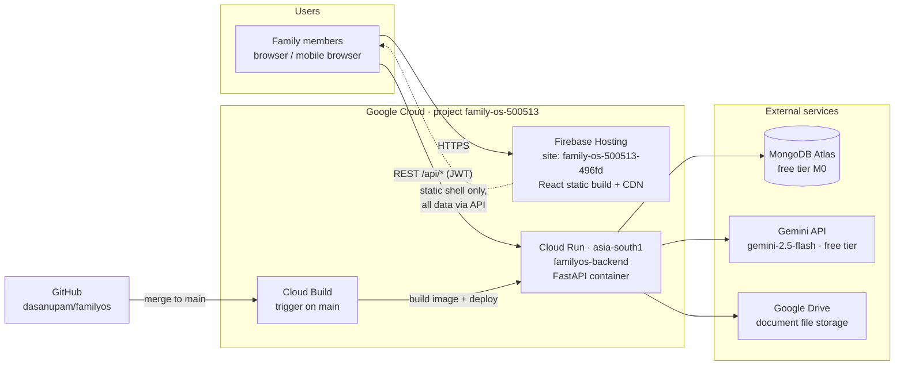
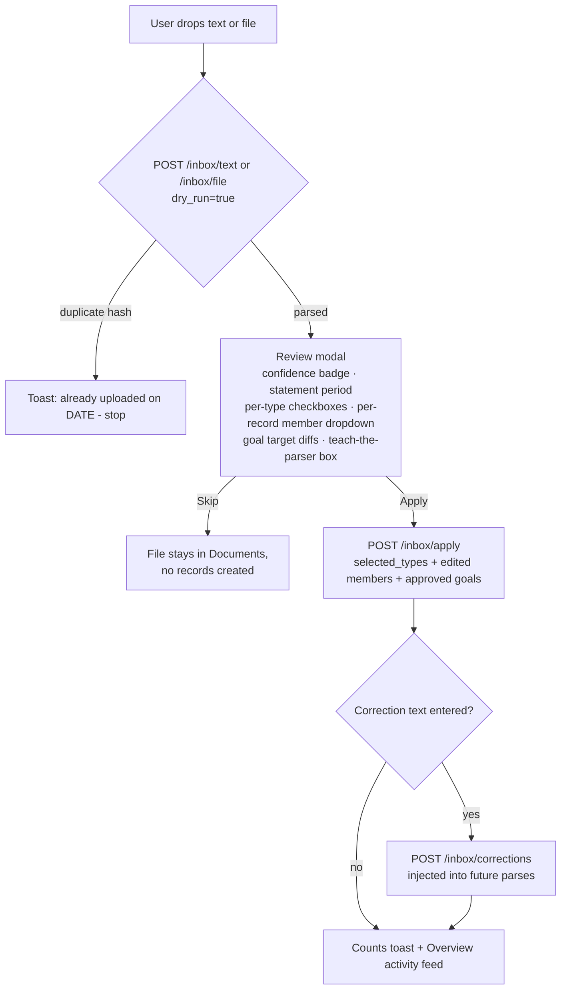
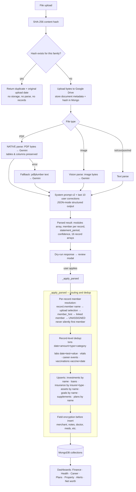
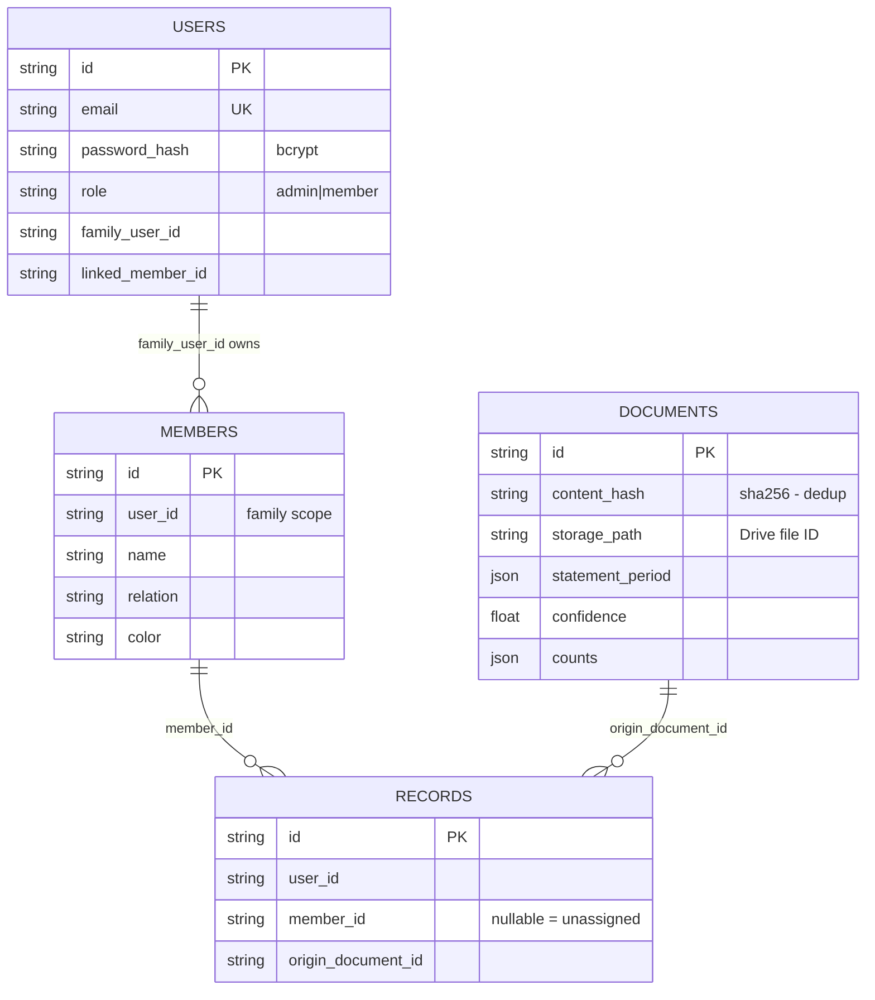
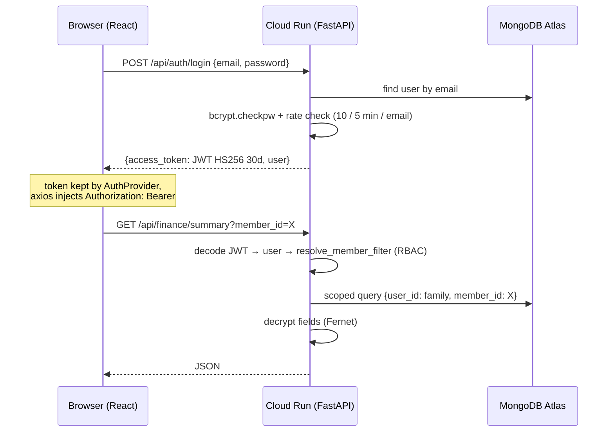
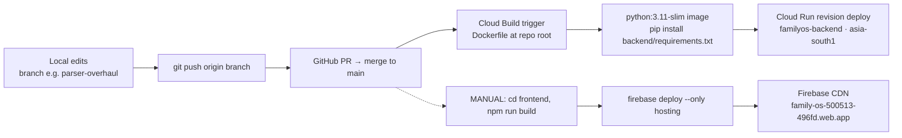

# FamilyOS — System Architecture

> Personal & Family Life Operating System: upload any document (payslip, lab report, tax form, plan, statement) and the AI extracts structured records into the right family member's dashboard for tracking and visualization.
>
> **Scope note:** this document describes the system as of the `parser-overhaul` branch (July 2026), which includes per-record member routing, dedup, the review queue, the corrections feedback loop, and the Plans module.

---

## 1. System context



**Key properties**

| Property | Value |
|---|---|
| Frontend URL | `https://family-os-500513-496fd.web.app` |
| Backend URL | `https://familyos-backend-29656244060.asia-south1.run.app` |
| GCP project | `family-os-500513` (Firebase project ID: `family-os-500513-496fd`) |
| Region | `asia-south1` (Mumbai) |
| Scaling | Min instances **0** (scale-to-zero), max 5, 512 MiB / 1 vCPU, request-based billing |
| Cold start | ~4–5 s after idle (acceptable for family use; keep Min=0 — Min=1 costs ~₹12/day idle) |

---

## 2. Technology stack

| Layer | Technology | Version / notes |
|---|---|---|
| Frontend | React + CRA (craco) | React 19, react-router-dom 7, Tailwind + shadcn/ui, lucide-react, sonner toasts |
| Backend | FastAPI (Python 3.11) | fastapi 0.110, uvicorn, async throughout |
| DB driver | Motor (async MongoDB) | motor 3.3 / pymongo 4.6 |
| AI | google-genai SDK | model from `GEMINI_MODEL` env (default `gemini-2.5-flash`), JSON-mode output |
| PDF fallback | pdfplumber | only when native PDF parse fails |
| File storage | Google Drive API v3 | OAuth refresh-token flow, files stored under one Drive folder |
| Auth | JWT (HS256) + bcrypt | 30-day tokens |
| Field encryption | Fernet (AES-128) | via `ENCRYPTION_KEY`; graceful no-op if unset |
| Container | `python:3.11-slim` Dockerfile | uvicorn on port 8080 |
| Hosting | Firebase Hosting | SPA rewrite to index.html, 1-year cache on js/css |

---

## 3. Frontend architecture

Single-page app. The hosting layer serves only the static build; every piece of data comes from `REACT_APP_BACKEND_URL/api/*` (baked in at **build time** — see §9 gotchas).

```
frontend/src/
├── App.js                  # Routes (react-router v7)
├── lib/
│   ├── api.js              # axios instance, injects Bearer token
│   └── auth.jsx            # AuthProvider: user, members, activeMember (family switcher)
├── components/
│   ├── AppShell.jsx        # top nav + mobile bottom nav, dark mode, ⌘K palette
│   ├── UniversalInbox.jsx  # THE core UX: text/file capture + review-confirm modal
│   ├── FamilySwitcher.jsx  # admin-only member context switcher
│   └── CommandPalette.jsx  # global search (backed by /api/search)
└── pages/
    Overview · FamilyOverview(household) · Finance · Health · Travel · Career
    Goals · Plans · Property · Documents · Family · Login · Register
```

**Routing / RBAC in UI:** `role=admin` sees all nav incl. Household & Family management; `role=member` sees a reduced nav. All record queries pass `member_id` from the active-member switcher; "family" = no filter (admin only).

**Universal Inbox flow (both text and file now go through review):**



---

## 4. Backend architecture

Single FastAPI service (`backend/server.py`, ~2,300 lines) with a service abstraction layer. All routes mounted under `/api`.

```
backend/
├── server.py               # routes, RBAC, inbox pipeline, _apply_parsed router
├── auth.py                 # bcrypt hashing, JWT create/decode (HS256, 30d)
├── ai_parser.py            # SWAP BOUNDARY: all Gemini calls + system prompt
├── services/
│   ├── storage_service.py  # SWAP BOUNDARY: Google Drive upload/download/delete
│   ├── crypto_service.py   # Fernet field encryption (per-collection field lists)
│   └── ai_service.py       # legacy helper
├── scripts/migrate_encrypt.py
└── tests/                  # pytest suites (iteration C/F/G, plan upload)
```

**RBAC model:** one admin owns the family; member-role users carry `family_user_id` (the admin's id) and `linked_member_id`. Every query is scoped by `user_id = family_user_id`; `resolve_member_filter()` forces member-role users onto their own `member_id` regardless of query params. Registration is **open** (creates a new admin + family) — access control relies on URL privacy; see §8.

**Endpoint map (grouped):**

| Group | Endpoints |
|---|---|
| Auth | `POST /auth/register` (invite-gated, rate-limited), `POST /auth/login` (rate-limited 10/5min), `GET /auth/me` |
| Invites | `GET/POST/DELETE /invites` (admin) — single-use codes, 14-day expiry, optional member link |
| Review | `GET /records/unassigned`, `PATCH/DELETE /records/unassigned/{kind}/{rid}` (admin) |
| Members | `GET/POST/DELETE /members` (admin only) |
| Universal Inbox | `POST /inbox/text` (dry_run supported), `POST /inbox/file` (hash dedup + dry_run), `POST /inbox/apply`, `GET /inbox/log`, `GET/POST/DELETE /inbox/corrections` |
| Finance | transactions, investments (+xirr), loans, sip, rsu, tax, insurance, subscriptions, budget, summary, summary/extended, monthly-trend, snapshot, net-worth-series |
| Health | supplements, active-medications, prescriptions, labs (+parameters), vitals, appointments, fitness, vaccinations |
| Goals & FIRE | `GET/POST/PATCH/DELETE /goals`, `GET/PUT /fire` |
| Plans | `GET/POST/PATCH/DELETE /plans`, `GET /plans/progress` (items auto-linked to goals/supplements) |
| Travel | trips, trip summary |
| Career | roles, events, skills |
| Property | properties, emergency-fund |
| Identity | encrypted identity documents |
| Cross-cutting | `GET /alerts` (labs out of range, BP, appointments, vaccinations due, SIP paused, RSU vesting, goal off-track, subscription/insurance/doc expiry), `GET /search`, `GET /export/{kind}` CSV, `PATCH /records/{kind}/{id}`, documents CRUD + download |

---

## 5. AI document-processing pipeline (the heart of the system)



**Prompt design (ai_parser.py):** the system prompt defines a strict JSON schema (16 record arrays) plus document-type playbooks:

- **Payslip** — current-month column only, never YTD; gross → income, tax/PF/insurance → expenses; never creates career events.
- **Tax docs (Form 16/ITR)** — annual totals, one expense row **per tax source** (salary TDS, TCS, LRS, RSU, ESPP, advance tax); never a CTC.
- **Lab report** — every test row with value/unit/reference range; patient name = record member.
- **Bank/CC statement** — every row, statement_period set.
- **Plans** — one `plans[]` entity (stable name → re-upload updates) + derived goals/supplements.
- **Mixed docs** (discharge summary) — extract *all* categories; `modules[]` lists everything found.
- **Corrections loop** — the last 10 user-entered corrections are appended to every prompt ("LEARNED CORRECTIONS"), so recurring documents self-improve.

Model is selected by the `GEMINI_MODEL` env var (default `gemini-2.5-flash`) — swap models with a Cloud Run env change, no code deploy.

---

## 6. Data model (MongoDB Atlas)

One database (name from `DB_NAME` env). No cross-collection joins — every record carries `user_id` (family scope) + `member_id` (person scope, **nullable = unassigned**) + optional `origin_document_id` (provenance link back to the uploaded file).



**Collections** (all follow the RECORDS pattern above):

| Domain | Collections |
|---|---|
| Core | `users`, `members`, `documents`, `inbox_log`, `update_log`, `inbox_corrections` |
| Finance | `transactions`*, `investments`*, `loans`, `sip_entries`, `rsu_grants`, `tax_records`, `insurance_policies`, `subscriptions`, `budgets`, `net_worth_snapshots` |
| Health | `lab_results`*, `prescriptions`*, `vitals`*, `supplements`, `appointments`*, `fitness_logs`, `vaccinations` |
| Life | `goals`, `plans`, `trips`, `career_roles`, `career_events`, `career_skills`, `properties`, `emergency_fund`, `identity_documents`*, `generic_entries` |

\* = has Fernet-encrypted fields (see §8). IDs are app-generated UUIDs (`id` field), Mongo `_id` is never exposed.

**Atlas free-tier caveat:** M0 clusters auto-pause after prolonged inactivity → backend returns 500s until manually resumed in Atlas UI.

---

## 7. Authentication & request flow



---

## 8. Security posture

| Control | Implementation | Notes / trade-offs |
|---|---|---|
| Passwords | bcrypt with per-hash salt | |
| Sessions | JWT HS256, `JWT_SECRET` env, 30-day expiry | 30d is long; shorten if exposure grows |
| Transport | HTTPS everywhere (Firebase + Cloud Run managed TLS) | |
| RBAC | family scoping on every query; member role locked to own member_id; admin-only member management | |
| Rate limiting | in-memory: login 10/5min, inbox 10/min per user | resets on instance restart (fine at min=0 scale) |
| Field encryption | Fernet AES-128 at rest for sensitive fields (merchant, notes, doctor, medications, doc numbers…) | no-op if `ENCRYPTION_KEY` unset; applied to both manual and AI-parsed inserts |
| Registration | **invite-only** — a leaked URL alone cannot create an account. Bootstrap: the first account on an empty DB becomes the family admin, no code needed. Every later registration requires a single-use, 14-day-expiry invite code generated by the admin (Family page), and joins the **inviter's** family (optionally linked to an existing member profile). Register attempts are rate-limited 5/5min per email. | invites live in the `invites` collection with used-by audit trail |
| File access | documents downloaded via backend proxy with token check | Drive files are not public |
| Secrets | all via Cloud Run env vars; none in repo | keep `.env` out of git |

---

## 9. CI/CD & deployment

Two independent deploy paths — **backend is automated, frontend is manual**:



**Backend (automatic):** merging to `main` triggers Cloud Build → container build from the root `Dockerfile` → new Cloud Run revision. Rollback = re-route traffic to a previous revision in the Cloud Run console.

**Frontend (manual):**
```bash
cd frontend
npm install          # first time; use --legacy-peer-deps if peer conflicts appear
npm run build        # REACT_APP_BACKEND_URL is baked in HERE from frontend/.env
cd ..
firebase deploy --only hosting
```

**Build-time gotchas (each of these has bitten before):**
1. `REACT_APP_BACKEND_URL` must exist in `frontend/.env` **before** `npm run build` — it is compiled into the bundle; setting it after building does nothing.
2. Firebase project ID is `family-os-500513-496fd` (Firebase appends a suffix to linked GCP projects) — already pinned in `.firebaserc`; verify with `firebase projects:list` if it ever errors.
3. Before any backend push: `python -m py_compile` every changed file (a corrupted file once reached prod with a `SyntaxError`).
4. `date-fns` is pinned to 3.x for `react-day-picker` compatibility.

### Environment variables

| Where | Variable | Purpose |
|---|---|---|
| Cloud Run | `MONGO_URL`, `DB_NAME` | Atlas connection |
| Cloud Run | `GEMINI_API_KEY` | Gemini API (free tier; per-project limits) |
| Cloud Run | `GEMINI_MODEL` | optional model override (default `gemini-2.5-flash`) |
| Cloud Run | `JWT_SECRET` | token signing |
| Cloud Run | `ENCRYPTION_KEY` | Fernet key for field encryption |
| Cloud Run | `GOOGLE_CLIENT_ID/_SECRET/_REFRESH_TOKEN`, `GOOGLE_DRIVE_FOLDER_ID` | Drive storage |
| Cloud Run | `CORS_ORIGINS` | allowed origins (frontend URL) |
| frontend/.env | `REACT_APP_BACKEND_URL` | backend base URL, baked at build time |

> **Note on Google AI Pro:** the consumer subscription does **not** raise Gemini *API* limits — API tiers depend on the GCP project's billing account. Free tier suffices at family volume; upgrading models beyond free tier requires linking billing (Tier 1).

---

## 10. Cost & scaling

| Item | Setting / expectation |
|---|---|
| Cloud Run | Min 0 / Max 5, request-based billing → ~₹0–1/day at family usage. **Never set Min=1** (the "Services Min Instance CPU" SKU billed ~₹12/day idle). |
| Gemini API | free tier; parsing calls are the slow path (10–40 s for big docs) — rate-limited to 10 uploads/min/user |
| MongoDB Atlas | M0 free tier; auto-pauses when idle |
| Google Drive | free storage quota of the linked account |
| Firebase Hosting | free tier CDN |
| Billing signals | instance-count metric reacts in minutes; the billing report lags ~1 day — check the metric first, confirm in tomorrow's bill |

---

## 11. Operations runbook

**Post-deploy checks (in order):**
1. Cloud Run → Revisions → new revision shows `Min: 0, Max: 5` (read the config, don't infer from graphs).
2. `GET <backend>/api/` returns FastAPI 404 JSON (service up); app login works end-to-end after a cold start (~5 s).
3. Metrics → container instance count returns to 0 within ~15 min of idle.
4. Upload one known document through the inbox; verify records land on the correct member.
5. Next day: billing report ≈ ₹0 for idle days. If not, the suspect is the Min-instance SKU.

**Common failures:**

| Symptom | Cause | Fix |
|---|---|---|
| All API calls 500 | Atlas auto-paused | Atlas console → Resume cluster |
| Login page loads, everything else fails | build made without `REACT_APP_BACKEND_URL` | set `frontend/.env`, rebuild, redeploy |
| Parse returns "Could not parse" | Gemini quota/model error | check Cloud Run logs; try `GEMINI_MODEL` fallback |
| Upload rejected as duplicate unexpectedly | same file bytes previously uploaded | it's working as designed — the original is in Documents |
| Wrong person's dashboard has a record | member name on doc didn't match | fix via review-modal dropdown next time + add a teach-the-parser correction |

**Tuning the parser:** never hard-code single-document fixes. Use the corrections box ("Payslips from NVIDIA — ignore the YTD column"); corrections ride along with every future parse. Prompt-level changes go to `ai_parser.py` `SYSTEM_PROMPT` — the only file that talks to Gemini.

---

## 12. Known gaps / roadmap

- ~~Unassigned records UI~~ — **done**: the Review page (`/review`, admin nav) lists all `member_id=null` records grouped by kind with per-record assign/delete.
- ~~Plans vs. actuals~~ — **done**: `GET /plans/progress` links plan items to goals/supplements by name; the Plans page shows per-item and per-plan progress bars.
- ~~Open registration~~ — **done**: invite-only registration (see §8).
- **Two-pass model routing** — send low-confidence (<0.7) parses to a stronger model (requires API billing / Tier 1).
- **Email flows** — forgot-password is a placeholder (no email service wired).
- **Rate limiting** — in-memory only; move to Mongo/Redis if instance count grows.
- **Tests** — pytest suites exist but aren't wired into Cloud Build; adding a test step before deploy would catch regressions.
- **JWT expiry** — 30 days is long-lived for a health+finance app; consider 7 days + refresh.
